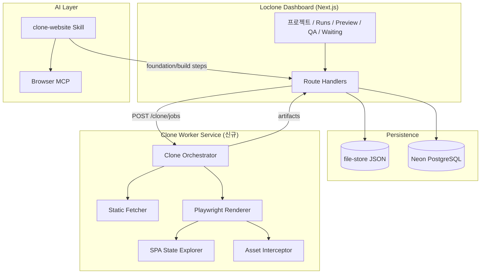

# Loclone 클로닝 플랫폼 종합 업그레이드 기획안

> **실행 로드맵(통합):** [UPGRADE_ROADMAP.md](./UPGRADE_ROADMAP.md) ← Phase 0~4 + HF/Kaggle 반영  
> 작성일: 2026-06-29  
> 목적: 기존 Loclone 대시보드를 메인 베이스로 유지하면서, 오픈소스 클로닝 기술을 통합·업그레이드하는 로드맵

---

## 1. 현재 보유 리포 (사이트 클론)

| 항목 | 내용 |
|------|------|
| **리포 주소** | https://github.com/shinkang888-code/loclone |
| **로컬 경로** | `e:\cursor\loclone` |
| **설명** | AI website clone platform with dashboard, QA, and handoff |
| **스택** | Next.js 16 · React 19 · shadcn/ui · Tailwind v4 · Zod · file-store |
| **최근 업데이트** | 2026-06-28 |

### 1.1 Loclone이 이미 갖춘 강점 (메인 베이스로 유지할 이유)

```
URL 입력 → 추출 → Next.js 클론 → QA → ZIP 납품
         ↑                              ↑
    에이전트 스킬 (/clone-website)    export API
```

| 영역 | 현재 구현 | 경쟁 리포 대비 |
|------|-----------|----------------|
| **대시보드 FE** | Sidebar + 프로젝트/실행/모니터/대기/Admin | AnyDownload·Crawl4AI 수준, 도메인 특화 우위 |
| **API 계층** | `/api/projects/[id]/clone`, `/api/runs`, `/api/projects/[id]/export` | REST 일관성 양호, 확장 포인트 명확 |
| **워크플로** | 프로젝트 → 클론 → preview 비교 → QA → export | **유일** (납품 파이프라인) |
| **AI 연동** | `.claude/skills/clone-website` 픽셀 클론 스킬 | websnap/ui.rip급 목표, 스킬은 이미 고품질 |
| **인간 개입** | `/dashboard/waiting` (환경변수·MCP 대기) | 타 리포에 없는 차별점 |

### 1.2 현재 클론 엔진 한계 (업그레이드 필요)

`src/lib/clone/run-clone.ts` 기준:

- `fetch()` + 정규식 HTML 파싱만 사용 (JS 렌더링 SPA 미지원)
- 단일 페이지 + img/icon/source 에셋만 수집
- CSS/JS 번들, 폰트, 다중 페이지 크롤 미지원
- Playwright/Puppeteer 워커 없음

→ **대시보드·API·납품 파이프라인은 Loclone 유지, 클론 코어는 외부 리포 기술 이식**

---

## 2. 벤치마크 GitHub 리포 분석

### 2.1 클론·미러 엔진 (기능 이식 대상)

| 리포 | Stars급 | 핵심 기술 | Loclone 이식 우선순위 | 가져올 기능 |
|------|---------|-----------|----------------------|-------------|
| [HenryLok0/AnyDownload](https://github.com/HenryLok0/AnyDownload) | 중 | Playwright/Puppeteer, static/render 모드, Web GUI | **P0** | `--mode render`, mirror preset, offline preview, wizard |
| [uirip/websnap](https://github.com/uirip/websnap) | 중 | SPA 상태 트리 BFS, daemon/client, 에셋 가로채기 | **P0** | 상태 해시·사이클 감지, 템플릿 dedup, daemon 아키텍처 |
| [MaheshDoiphode/site-mirror](https://github.com/MaheshDoiphode/site-mirror) | 소 | Playwright, sitemap seed, SPA 오프라인 nav | **P1** | sitemap.xml 시드, sameOrigin 크롤, `_external` 분리 |
| [nikomarinovic/WebCloner](https://github.com/nikomarinovic/WebCloner) | 소 | Python, 전체 사이트 크롤, 링크 재작성 | **P1** | 내부 링크 BFS, 오프라인 네비게이션 재작성 |
| [sirioberati/WebTwin](https://github.com/sirioberati/WebTwin) | 중 | Flask + Selenium, UI 컴포넌트 분석, ZIP | **P2** | 컴포넌트 인벤토리(heuristic), ZIP 구조 참고 |

### 2.2 인프라·오케스트레이션 (백엔드 확장)

| 리포 | 역할 | Loclone 이식 | 가져올 기능 |
|------|------|-------------|-------------|
| [unclecode/crawl4ai](https://github.com/unclecode/crawl4ai) | 셀프호스트 크롤 API + 모니터링 | **P1** | `/dashboard` 실시간 메트릭, browser pool, playground 패턴 |
| [devflowinc/firecrawl-simple](https://github.com/devflowinc/firecrawl-simple) | Redis + Bull 워커 큐 | **P2** | 장시간 mirror job 큐잉, Playwright 마이크로서비스 분리 |
| [ozenalp22/webrecon](https://github.com/ozenalp22/webrecon) | 6-agent 병렬 분석 | **P2** | Design/Tech/API/SEO 병렬 에이전트 → QA 확장 |

### 2.3 대시보드 UX 참고 (FE 패턴만 차용)

| 리포 | 대시보드 특징 | Loclone 적용 |
|------|--------------|-------------|
| [HenryLok0/AnyDownload](https://github.com/HenryLok0/AnyDownload) | Electron + React GUI, 진행률·프리셋 | `clone-workspace`에 preset UI, 실시간 로그 |
| [unclecode/crawl4ai](https://github.com/unclecode/crawl4ai) | `:11235/dashboard` 시스템·브라우저 풀 | `/dashboard/admin` 확장 |
| [pashitox/web-twin](https://github.com/pashitox/web-twin) | Next.js KPI 카드, 시뮬레이션 결과 | `/dashboard/runs/[runId]` 메트릭 카드 |

### 2.4 메인 베이스 선정 결론

```
┌─────────────────────────────────────────────────────────┐
│  MAIN BASE: shinkang888-code/loclone (현 리포)          │
│  ─────────────────────────────────────────────────────  │
│  FE: Next.js App Router + shadcn Sidebar 대시보드       │
│  BE: Route Handlers + file-store → Neon/Supabase 전환   │
│  DIFF: QA · Preview Compare · Waiting · Export ZIP      │
└─────────────────────────────────────────────────────────┘
          │
          ├── Clone Engine Worker (신규) ← AnyDownload + websnap
          ├── Job Queue (선택) ← firecrawl-simple 패턴
          └── Monitoring UI ← Crawl4AI 패턴
```

**타 리포를 메인으로 쓰지 않는 이유**

- AnyDownload: CLI/GUI는 우수하나 **납품·QA·프로젝트 워크플로 없음**
- Crawl4AI: 크롤 API·모니터링은 최고이나 **Next.js 클론·에이전트 handoff 없음**
- WebTwin(Flask): ZIP 추출은 좋으나 **FE/BE가 Loclone보다 단순**

---

## 3. 목표 아키텍처

### 3.1 레이어 분리



### 3.2 클론 모드 (AnyDownload preset 이식)

| 모드 | 엔진 | 용도 | Loclone UI 라벨 |
|------|------|------|-----------------|
| `static` | fetch + cheerio/regex | 블로그·문서 | 빠른 추출 |
| `render` | Playwright 단일 페이지 | SPA 랜딩 | JS 렌더 |
| `full` | BFS depth=2 | 소형 사이트 | 전체 사이트 (얕음) |
| `mirror` | BFS depth=5 + sitemap | 포트폴리오·마케팅 | 미러 |
| `spa-states` | websnap 상태 트리 | React/Vue 앱 | SPA 상태 탐색 |
| `agent-pixel` | Browser MCP + Skill | 픽셀 퍼펙트 | AI 에이전트 클론 |

### 3.3 API 확장 설계

기존 유지 + 신규:

```
POST   /api/projects/[id]/clone          # body: { url, mode, options }
GET    /api/runs/[runId]                 # + steps[], progress, engine
GET    /api/runs/[runId]/logs            # 실시간 SSE (Crawl4AI 패턴)
POST   /api/runs/[runId]/cancel
GET    /api/runs/[runId]/preview         # offline serve URL
POST   /api/projects/[id]/clone/agent    # 에이전트 foundation 트리거
```

**CloneRequest 확장 (Zod)**

```typescript
// src/lib/schemas/project.ts (계획)
{
  url: string;
  mode: "static" | "render" | "full" | "mirror" | "spa-states" | "agent-pixel";
  options?: {
    maxDepth?: number;
    maxPages?: number;
    sameOriginOnly?: boolean;
    seedSitemaps?: boolean;
    browser?: "playwright" | "puppeteer";
    headless?: boolean;
    authProfileId?: string;
  };
}
```

---

## 4. 기능 이식 매트릭스

### Phase 0 — 기반 정리 (1주)

| # | 작업 | 참고 리포 | Loclone 파일 |
|---|------|-----------|--------------|
| 0.1 | `CloneMode` 타입·스키마 추가 | AnyDownload CLI flags | `src/types/clone.ts`, `src/lib/schemas/project.ts` |
| 0.2 | Run step 상태 머신 확장 | Crawl4AI job states | `src/lib/store/types.ts` |
| 0.3 | Clone UI에 mode/preset 선택 | AnyDownload GUI | `src/components/clone/clone-workspace.tsx` |
| 0.4 | Runs 상세 페이지 진행률·로그 | Crawl4AI dashboard | `src/app/dashboard/runs/[runId]/page.tsx` |

### Phase 1 — Playwright Worker (2~3주) ★ 핵심

| # | 작업 | 참고 | 신규 파일 |
|---|------|------|-----------|
| 1.1 | Playwright 의존성 + Docker sidecar | site-mirror | `docker-compose.yml`, `services/clone-worker/` |
| 1.2 | Render 모드 (단일 페이지 + 네트워크 idle) | AnyDownload `--mode render` | `services/clone-worker/render.ts` |
| 1.3 | 에셋 가로채기 (CSS/JS/font/img) | websnap | `services/clone-worker/intercept-assets.ts` |
| 1.4 | URL 재작성 + 로컬 저장 | WebCloner | `services/clone-worker/rewrite-links.ts` |
| 1.5 | Loclone API ↔ Worker HTTP/gRPC | firecrawl-simple | `src/lib/clone/worker-client.ts` |
| 1.6 | `run-clone.ts`를 orchestrator로 리팩터 | — | `src/lib/clone/run-clone.ts` |

### Phase 2 — 다중 페이지 & SPA (2주)

| # | 작업 | 참고 |
|---|------|------|
| 2.1 | BFS 크롤 + sameOrigin | site-mirror, WebCloner |
| 2.2 | sitemap.xml 시드 | site-mirror `--seedSitemaps` |
| 2.3 | SPA 상태 트리 (선택) | websnap BFS + state hash |
| 2.4 | mirror preset (depth 5) | AnyDownload `--preset mirror` |

### Phase 3 — 대시보드·모니터링 (1~2주)

| # | 작업 | 참고 | Loclone 화면 |
|---|------|------|-------------|
| 3.1 | Worker health + browser pool 카드 | Crawl4AI `/dashboard` | `/dashboard/admin` |
| 3.2 | Run 실시간 SSE 로그 스트림 | Crawl4AI | `/dashboard/runs/[runId]` |
| 3.3 | Offline preview iframe | AnyDownload offline preview | `/dashboard/projects/[id]/preview` |
| 3.4 | Clone preset wizard (3-step) | AnyDownload `--wizard` | clone-workspace wizard |

### Phase 4 — QA·분석 통합 (2주)

| # | 작업 | 참고 | Loclone 화면 |
|---|------|------|-------------|
| 4.1 | Design token 추출 리포트 | webrecon Design agent | `/dashboard/projects/[id]/qa` |
| 4.2 | Tech stack 감지 | INSPECTION_GUIDE Phase 4 | QA 패널 확장 |
| 4.3 | 원본 vs 클론 diff 스크린샷 | preview-compare 확장 | preview 페이지 |
| 4.4 | SEO 점수 (기존 skill 연동) | web-seo skill | QA export |

### Phase 5 — 스케일 & 큐 (선택)

| # | 작업 | 참고 |
|---|------|------|
| 5.1 | Redis + Bull job queue | firecrawl-simple |
| 5.2 | Neon PostgreSQL 전환 | waiting 목록 가이드 |
| 5.3 | Vercel + Worker Render 분리 배포 | Render platform rules |

---

## 5. 디렉터리 구조 (목표)

```
loclone/
├── src/
│   ├── app/dashboard/          # 기존 유지 + runs SSE, admin metrics
│   ├── app/api/                # clone jobs, worker callback
│   ├── components/clone/       # mode selector, log viewer, wizard
│   ├── lib/clone/
│   │   ├── run-clone.ts        # orchestrator
│   │   ├── worker-client.ts    # worker HTTP client
│   │   ├── extract.ts          # static fallback
│   │   └── modes/              # static | render | mirror | spa
│   └── types/clone.ts
├── services/
│   └── clone-worker/           # Playwright microservice (신규)
│       ├── Dockerfile
│       ├── package.json
│       ├── server.ts
│       ├── engines/
│       │   ├── static-fetch.ts
│       │   ├── playwright-render.ts
│       │   ├── site-crawler.ts
│       │   └── spa-explorer.ts   # websnap-inspired
│       └── lib/
│           ├── asset-interceptor.ts
│           └── link-rewriter.ts
├── docs/
│   ├── plan/CLONE_UPGRADE_PLAN.md   # 본 문서
│   └── research/                    # per-site artifacts (기존)
└── docker-compose.yml               # app + clone-worker + redis(optional)
```

---

## 6. UI/UX 와이어 (Clone Workspace 업그레이드)

```
┌──────────────────────────────────────────────────────────────────┐
│ 프로젝트: example.com 클론                                        │
├──────────────────────────────────────────────────────────────────┤
│ URL: [ https://example.com                    ] [ 클론 시작 ]     │
│                                                                  │
│ 모드: (●) JS 렌더  ( ) 빠른 정적  ( ) 미러  ( ) SPA  ( ) AI픽셀   │
│ 고급: maxDepth [3]  maxPages [50]  [✓] sitemap  [✓] sameOrigin   │
├──────────────────────────────────────────────────────────────────┤
│ 진행 상태                                    Run #abc123           │
│ ████████████░░░░░░░░ 62%  extract ✓  assets ●  rewrite ○       │
│ [실시간 로그] 12:01 Playwright launched...                       │
│              12:02 Captured 47 assets (css:12 js:8 img:27)       │
├──────────────────────────────────────────────────────────────────┤
│ [미리보기] [원본 vs 클론] [QA] [ZIP 내보내기]                     │
└──────────────────────────────────────────────────────────────────┘
```

---

## 7. 기술 의사결정

| 결정 | 선택 | 근거 |
|------|------|------|
| 메인 코드베이스 | **Loclone** | 납품 파이프라인·대시보드·에이전트 스킬 완비 |
| 브라우저 엔진 | **Playwright** (1차) | AnyDownload·site-mirror·websnap·Crawl4AI 공통 |
| Worker 분리 | **별도 Node 서비스** | Next.js Vercel serverless timeout 회피 |
| Static fallback | 기존 `extract.ts` 유지 | 빠른 1차 추출·테스트 |
| AI 픽셀 클론 | 기존 Skill 유지 | 이미 474줄 고품질 스펙 |
| DB | file-store → **Neon** | waiting 목록에 이미 계획됨 |
| 큐 | Phase 5에서 Redis | mirror 대형 job 전용 |

---

## 8. 리스크 & 대응

| 리스크 | 대응 |
|--------|------|
| SPA/인증 사이트 클론 실패 | waiting 목록 + 수동 로그인 프로필 (AnyDownload auth) |
| Vercel 함수 60s 제한 | Worker를 Render/Railway/Docker sidecar로 분리 |
| 저작권·ToS | 대시보드에 "교육·내부 참고용" 고지 + robots.txt 존중 옵션 |
| websnap SPA 전체 이식 복잡도 | Phase 2.3을 optional flag로, MVP는 render+mirror만 |

---

## 9. 성공 지표 (KPI)

| 지표 | 현재 | Phase 1 목표 | Phase 2 목표 |
|------|------|-------------|-------------|
| SPA 랜딩 클론 성공률 | ~10% (fetch only) | 70%+ | 85%+ |
| 수집 에셋 종류 | img/icon | +css+js+font | +video+svg |
| 다중 페이지 | 1 | 1 | depth 3, 50 pages |
| Run 가시성 | status만 | 실시간 로그 | SSE + admin metrics |
| 납품 ZIP | HTML 스냅샷 | 오프라인 browsable | +Next.js 소스 |

---

## 10. 즉시 실행 체크리스트 (다음 스프린트)

- [ ] `docs/plan/CLONE_UPGRADE_PLAN.md` 팀 리뷰
- [ ] `services/clone-worker/` scaffold + docker-compose
- [ ] `CloneMode` 타입 + clone-workspace UI preset 버튼
- [ ] AnyDownload README에서 render/mirror 옵션 매핑표 작성 (`docs/research/ANYDOWNLOAD_MAP.md`)
- [ ] `run-clone.ts` → mode 분기 (static=기존, render=worker stub)
- [ ] `/dashboard/runs/[runId]` step 타임라인 UI

---

## 부록 A — 참고 URL 모음

| 분류 | URL |
|------|-----|
| **내 리포** | https://github.com/shinkang888-code/loclone |
| AnyDownload | https://github.com/HenryLok0/AnyDownload |
| websnap | https://github.com/uirip/websnap |
| site-mirror | https://github.com/MaheshDoiphode/site-mirror |
| WebCloner | https://github.com/nikomarinovic/WebCloner |
| WebTwin (extract) | https://github.com/sirioberati/WebTwin |
| Crawl4AI | https://github.com/unclecode/crawl4ai |
| firecrawl-simple | https://github.com/devflowinc/firecrawl-simple |
| webrecon | https://github.com/ozenalp22/webrecon |
| web-twin (analysis UI) | https://github.com/pashitox/web-twin |

## 부록 B — Loclone 기존 API ↔ 화면 매핑

| API | Dashboard |
|-----|-----------|
| `POST /api/projects/[id]/clone` | `/dashboard/projects/[id]/clone` |
| `GET /api/runs`, `GET /api/runs/[runId]` | `/dashboard/runs` |
| `GET /api/projects/[id]/qa` | `/dashboard/projects/[id]/qa` |
| `POST /api/projects/[id]/export` | 프로젝트 상세 export 버튼 |
| `GET /api/waiting` | `/dashboard/waiting` |
| `GET /api/sites` | `/dashboard/sites` |

## 부록 C — Hugging Face CLI 검색 결과 (2026-06-29)

> 검색 도구: `hf spaces search`, `hf datasets list --search`, `hf models list --search`

### C.1 Website Clone Spaces (직접 관련)

| Space | URL | SDK | Loclone 이식 가치 |
|-------|-----|-----|------------------|
| Website Clone | https://huggingface.co/spaces/robinnuttin30/website-clone | static | UI 레퍼런스 |
| Website Clone Wizardry | https://huggingface.co/spaces/Camdeon/website-clone-wizardry | static | 위저드 UX 참고 |
| Website Cloner Pro | https://huggingface.co/spaces/uzairayed2/website-cloner-pro | static | 클론 UI 패턴 |
| Cloned Website Replica Master | https://huggingface.co/spaces/dharsan777/cloned-website-replica-master | static | 복제 결과 프리뷰 |
| Website Cloner Backend | https://huggingface.co/spaces/0ZeroXD/website-cloner-backend | docker | **백엔드 분리 패턴** (Worker 참고) |
| LandingSite Clone | https://huggingface.co/spaces/gadgitmatic/landingsite-clone-ai-powered-website-builder | static | AI 랜딩 클론 |

### C.2 크롤·스크래핑 + 대시보드 Spaces (엔진·모니터링)

| Space | URL | 특징 | Loclone 이식 |
|-------|-----|------|-------------|
| Crawl4AI (re-mind) | https://huggingface.co/spaces/re-mind/Crawl4AI | Docker, LLM-ready 크롤 | Worker 엔진 후보 **P0** |
| LLM Web Scraper | https://huggingface.co/spaces/frkhan/llm-web-scrapper | Gradio, **FireCrawl + Crawl4AI** 듀얼 백엔드 | 스크래퍼 선택 UI |
| CRAWL-GPT-CHAT | https://huggingface.co/spaces/jatinmehra/CRAWL-GPT-CHAT | Streamlit, Playwright, FAISS RAG | 크롤+챗 파이프라인 |
| ScrapeFlow Dashboard | https://huggingface.co/spaces/ShoppingSW/scrapeflow-web-scraping-dashboard-delight | 스크래핑 대시보드 UI | `/dashboard/runs` UX |
| Awesome AI Web Search | https://huggingface.co/spaces/Felladrin/awesome-ai-web-search | 큐레이션 목록 (70 likes) | 리소스 허브 |
| AgentX | https://huggingface.co/spaces/Raam751/AgentX | AI Browser Automation | 에이전트 클론 연동 |
| Qwen3 Coder WebDev | https://huggingface.co/spaces/Qwen/Qwen3-Coder-WebDev | URL→코드 생성 (1094 likes) | agent-pixel 모드 보조 |
| Gemma Diffusion Website Builder | https://huggingface.co/spaces/huggingface-projects/diffusiongemma-codegen | AI 웹사이트 생성 | 참고용 |

### C.3 Hugging Face Datasets (크롤·sitemap·URL 수집)

| Dataset | URL | 용도 |
|---------|-----|------|
| sitemap-to-url-crawler-sample-data | https://huggingface.co/datasets/logiover/sitemap-to-url-crawler-sample-data | **sitemap → URL 리스트** (site-mirror 시드) |
| website-contact-scraper-sample-data | https://huggingface.co/datasets/logiover/website-contact-scraper-sample-data | 연락처·소셜 추출 스키마 |
| UN_Sitemap_Multilingual_HTML_Corpus | https://huggingface.co/datasets/ranWang/UN_Sitemap_Multilingual_HTML_Corpus | sitemap 기반 다국어 HTML 코퍼스 (~14GB) |
| web-crawl-2026 | https://huggingface.co/datasets/OpenTransformer/web-crawl-2026 | 대규모 웹 코퍼스 (pretraining) |
| dead-web-index | https://huggingface.co/datasets/crawlora-net/dead-web-index | 링크 로트·도메인 reachability |
| dead-web-commoncrawl | https://huggingface.co/datasets/crawlora-net/dead-web-commoncrawl | Common Crawl dead domain |

### C.4 Hugging Face Blog / Docs (가이드)

| 제목 | URL | Loclone 활용 |
|------|-----|-------------|
| Ultimate Guide to Website Crawling (Top 20) | https://huggingface.co/blog/samihalawa/crawling-mster-best-scrap-guide | wget/HTTrack/SingleFile 비교표 |
| Chat with any full website | https://huggingface.co/blog/airabbitX/chat-with-any-full-website | 전체 사이트 크롤+RAG 패턴 |
| Crawl4AI 가이드 | https://huggingface.co/blog/lynn-mikami/crawl-ai | deep_crawl BFS 설정 |
| smolagents Web Browser | https://huggingface.co/docs/smolagents/main/en/examples/web_browser | Helium 브라우저 에이전트 |

### C.5 HF → Loclone 통합 우선순위

| 우선순위 | 소스 | 이식 내용 |
|----------|------|-----------|
| **P0** | re-mind/Crawl4AI Space | Playwright 크롤 Worker API |
| **P0** | logiover/sitemap datasets | mirror 모드 URL 시드 |
| **P1** | frkhan/llm-web-scrapper | FireCrawl/Crawl4AI 듀얼 엔진 선택 |
| **P1** | ShoppingSW/scrapeflow | Run 로그·진행률 대시보드 UI |
| **P1** | 0ZeroXD/website-cloner-backend | FE/BE 분리 Docker 패턴 |
| **P2** | jatinmehra/CRAWL-GPT-CHAT | 크롤 후 LLM QA/RAG 확장 |
| **P2** | aleexporebis/atanor-bandi-api | Streamlit acquisition panel (크롤 히스토리 탭) |

---

## 부록 D — Kaggle CLI / 웹 검색 결과 (2026-06-29)

> **참고:** 로컬 `kaggle` CLI는 인증 필요 (`kaggle auth login`). 아래는 웹 검색 + HF 미러 데이터셋 교차 확인.

### D.1 Kaggle Datasets (클론·크롤 직접 관련)

| Dataset | URL | 설명 | Loclone 이식 |
|---------|-----|------|-------------|
| Sitemap to URL Crawler | https://www.kaggle.com/datasets/logiover/sitemap-to-url-crawler-data | sitemap.xml 재귀 URL 추출 샘플 | mirror 시드 **P0** |
| (HF 동일) | https://huggingface.co/datasets/logiover/sitemap-to-url-crawler-sample-data | Kaggle과 동일 Actors 샘플 | API 스키마 참고 |

### D.2 Kaggle Notebooks (크롤·동적 스크래핑 레퍼런스)

| Notebook | URL | 기술 | Loclone 활용 |
|----------|-----|------|-------------|
| Scrape dynamic website with selenium | https://www.kaggle.com/code/yingfu46/scrape-dynamic-website-with-selenium | Selenium | render 모드 fallback 참고 |
| Web Scraping e-IPO with Selenium | https://www.kaggle.com/code/fahmirk/web-scraping-e-ipo-data-with-selenium | Selenium | 동적 테이블 추출 |
| Web scraping BeautifulSoup + Requests | https://www.kaggle.com/code/imoore/web-scraping-using-beautifulsoup-and-requests-libs | static | `extract.ts` 개선 참고 |
| Web Scraping with requests_html | https://www.kaggle.com/code/adahmed/web-scraping-with-requests-html | JS 렌더 (requests-html) | static/render 중간층 |
| web crawler | https://www.kaggle.com/code/mackuber/web-crawler | BFS 크롤러 | mirror BFS 로직 |
| Webscraping webcrawler wikipedia | https://www.kaggle.com/code/adepvenugopal/webscraping-webcrawler-wikipedia | 위키 BFS | 다중 페이지 패턴 |
| Web Scraping Basics with Python | https://www.kaggle.com/code/arslanali4343/web-scraping-basics-with-python | 입문 | 교육용 |
| Web Scraping for E-Commerce | https://www.kaggle.com/code/evilspirit05/web-scraping-for-e-commerce-insights | pandas | 구조화 추출 |

### D.3 Kaggle → Loclone 이식 매핑

| Kaggle 패턴 | Loclone 적용 위치 | Phase |
|-------------|------------------|-------|
| Selenium/requests-html 동적 렌더 | `services/clone-worker/render.ts` | 1 |
| BFS web crawler (mackuber, wikipedia) | `services/clone-worker/site-crawler.ts` | 2 |
| sitemap URL 리스트 (logiover) | clone 옵션 `seedSitemaps: true` | 2 |
| BeautifulSoup 정적 파싱 | `src/lib/clone/extract.ts` static 모드 | 0 |

### D.4 Kaggle CLI 재검색 명령 (인증 후)

```powershell
kaggle auth login
kaggle datasets list -s "sitemap crawler" --page-size 20
kaggle datasets list -s "website scraper" --page-size 20
kaggle kernels list -s "website clone" --page-size 20
kaggle kernels list -s "web crawler selenium" --page-size 20
```

---

## 부록 E — 3플랫폼 통합 우선순위 (GitHub + HF + Kaggle)

| 순위 | 플랫폼 | 리소스 | 역할 |
|------|--------|--------|------|
| 1 | GitHub | **loclone** (메인) | 대시보드·API·납품 |
| 2 | GitHub | AnyDownload + websnap | 클론 Worker 코어 |
| 3 | HuggingFace | re-mind/Crawl4AI + logiover sitemap | 크롤 API + URL 시드 |
| 4 | HuggingFace | frkhan/llm-web-scrapper | 듀얼 스크래퍼 UI |
| 5 | Kaggle | logiover/sitemap-to-url-crawler | sitemap 시드 데이터·스키마 |
| 6 | Kaggle | selenium/playwright 노트북들 | render/crawler 구현 참고 |
| 7 | GitHub | kutyfuty/ultimate-web-cloner | Visual QA·품질 리포트 (Phase 4) |

---

*본 기획안은 Loclone 리포 내부 `docs/plan/`에 두고, Phase별로 GitHub Issue/Project 보드와 연동하는 것을 권장합니다.*
